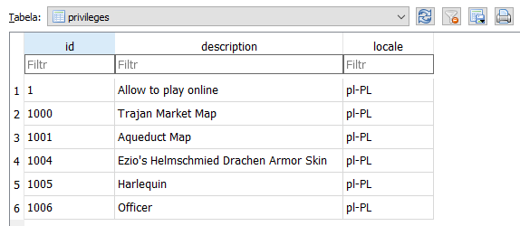

# Assassin's Creed Brotherhood RDV

Matchmaking/online service (Quazal's Rendez-Vous, RDV) backend for AC Brotherhood.

There's no need for dedicated game server implementation as AC multiplayers are all P2P.

Credits for the original implementation of GRO backend go to [@Warranty Voider](https://github.com/zeroKilo).

## Configuration
Here's the configuration needed to set up your environment.

### Database
As of now the database file is excluded from git tracking. Once a proper schema emerges it will be committed.

1. Install [SQLite Browser](https://sqlitebrowser.org/dl/)) and create `database.sqlite` file inside `./ACB RDV/bin/<architecture>/<mode>`.

2. Create the needed tables:

- `users`

```sql
CREATE TABLE "users" (
    "id"    INTEGER PRIMARY KEY AUTOINCREMENT,
    "pid"    BIGINT,
    "name"    TEXT,
    "password"    TEXT,
    "ubi_id"    TEXT,
    "email"    TEXT,
    "country_code"    TEXT,
    "pref_lang"    TEXT
)
```

- `privileges`

```sql
CREATE TABLE privileges (
	id			INTEGER,
	description	TEXT,
	locale 		TEXT
)
```

3. Populate `users` table:
- add `Tracking` user for the game's telemetry service
```sql
INSERT INTO users VALUES (1,'Tracking','JaDe!','1234abcd-5678-90ef-4321-0987654321fe','tracking@ubi.com', 'US', 'en')
```

- add your account (change `<username>` and `<password>`)
```sql
INSERT INTO users VALUES (2,'<username>','<password>','1234abcd-5678-90ef-4321-0987654321ff','some@email.com', 'US', 'en')
```

If you want to start the game **from SP binary** you will need your real credentials, email and [Ubi account ID](https://www.reddit.com/r/uplay/comments/piyp3h/how_to_find_your_ubisoft_connect_account_id/) to be able to log in as these are used by Ubi's Orbit API.


4. Populate `privileges` table:

```sql
INSERT INTO privileges VALUES (1,'Allow to play online','en-US'),(1000,'Trajan Market Map','en-US'),(1001,'Aqueduct Map','en-US'),(1004,'Ezio's Helmschmied Drachen Armor Skin','en-US'),(1005,'Harlequin','en-US'),(1006,'Officer','en-US');
```



### Application
Create `ACBRDV.exe.config` configuration file in `./ACB RDV/bin/<architecture>/<mode>`:

```xml
<?xml version="1.0" encoding="utf-8"?>
<configuration>
    <startup> 
        <supportedRuntime version="v4.0" sku=".NETFramework,Version=v4.8"/>
    </startup>
	<appSettings>
      <add key="SecureServerAddress" value="<server host IP>" />
    </appSettings>
</configuration>
```

Set `<server host IP>` to the server host's IP depending on your environment (localhost/LAN/Internet).

Make sure the `.cxb` file is present in your server executable's directory.

#### Clients

On every **client** machine add an entry in `C:\Windows\System32\drivers\etc\hosts` to redirect the game's network traffic to the server:
```
<server host IP> onlineconfigservice.ubi.com
```

`<server host IP>` should match that of `ACBRDV.exe.config` for all environment scenarios (localhost/LAN/Internet).

You will likely need admin permissions to save `hosts` file.

## Running and debugging

### Server

Make sure the required ports are available:

| Protocol | Port | Service | Availability |
|---|---|---|---|
| HTTP | 80 | OnlineConfigSvc | Often used by [IIS](https://en.wikipedia.org/wiki/Internet_Information_Services) |
| UDP | 21030 | Quazal auth | Usually available |
| UDP | 21031 | RDV | Usually available |


Make sure you have all required NuGet packages installed.

Build `ACB RDV` project in Visual Studio.

Either:
- run `ACB RDV` project through Visual Studio to debug it
- use `_runme.bat` in the root directory to run the server executable

`./ACB RDV/bin/<architecture>/<mode>/log.txt` contains detailed server log from the last/current run.

### Client

Run this command from ACB root directory to start the game:

```
ACBMP.exe /onlineUser:<user> /onlinePassword:<password>
```

Change `<user>` and `<password>` to your credentials from the database file (the user other than `Tracking`).
